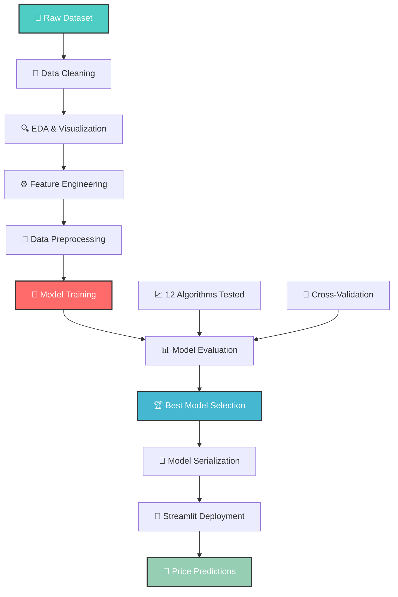

# 💻 SpectraPrice - Intelligent Price Prediction Engine

<div align="center">
  
  [](https://scikit-learn.org)
  [](https://streamlit.io)
 
  [](https://pandas.pydata.org)
  
  **An intelligent laptop price prediction system using ensemble machine learning models**
  
  *Predict laptop prices accurately based on 12 key specifications using advanced regression techniques!*
  
</div>

## 🌟 Features

<div align="center">
  
  | 🤖 **Ensemble Learning** | 🎯 **Smart Predictions** | 📊 **Comprehensive EDA** |
  |:---------------------:|:----------------------:|:--------------------------:|
  | Multiple regression models | High accuracy predictions | Deep data analysis |
  | Voting & Stacking methods | R² score: 0.87+ | Visual insights |
  
  | 🎨 **Interactive UI** | 🔄 **Feature Engineering** | 📈 **Model Comparison** |
  |:----------------------:|:-----------------------:|:---------------------------:|
  | Streamlit web interface | 20+ engineered features | 12+ tested algorithms |
  | Real-time predictions | Smart preprocessing | Performance benchmarking |
  
</div>

## ✨ What makes this Predictor special?

- **🤖 Advanced Ensemble Learning** - Combines Random Forest, XGBoost, Gradient Boosting for superior accuracy
- **🎯 High Prediction Accuracy** - R² score of 0.87+ with mean absolute error under 0.15
- **📊 Extensive EDA** - Comprehensive exploratory data analysis with 15+ visualizations
- **🔄 Smart Feature Engineering** - Transforms raw specs into 20+ meaningful features
- **🎨 User-Friendly Interface** - Beautiful Streamlit web app for instant predictions
- **💾 Model Persistence** - Trained models saved for instant deployment
- **📈 Multiple Algorithms** - Tested 12 different regression models for optimal performance
- **🔧 Production Ready** - Complete pipeline from data preprocessing to deployment

## 🚀 Quick Start

### Prerequisites

```bash
# Python 3.8 or higher
python --version

# pip package manager
pip --version
```

### Installation

1. **Clone the repository**
   ```bash
   git clone https://github.com/yourusername/laptop-price-predictor.git
   cd laptop-price-predictor
   ```

2. **Install dependencies**
   ```bash
   pip install numpy pandas matplotlib seaborn
   pip install scikit-learn xgboost
   pip install streamlit
   pip install pickle-mixin
   ```

3. **Run the Streamlit app**
   ```bash
   streamlit run app.py
   ```

4. **Make predictions!**
   - Select laptop specifications from dropdowns
   - Click "Predict Price" button
   - Get instant price prediction in your currency

## 🛠️ Tech Stack

<div align="center">
  
  
  
  
  
  
  
  
  
</div>

### Core Technologies

- **Machine Learning Framework**: Scikit-learn (Pipeline, preprocessing, and 10+ regression models)
- **Ensemble Methods**: XGBoost (Gradient boosting implementation)
- **Web Framework**: Streamlit (Interactive web application)
- **Data Processing**: Pandas & NumPy (Data manipulation and numerical computing)
- **Visualization**: Matplotlib & Seaborn (Exploratory data analysis)
- **Model Persistence**: Pickle (Model and data serialization)

## 💡 How It Works

### ML Pipeline Architecture



### Prediction Process

1. **📊 Data Collection** - User inputs laptop specifications through Streamlit interface
2. **🔄 Preprocessing** - Features are transformed using OneHotEncoding for categorical variables
3. **⚙️ Feature Engineering** - Calculate PPI (pixels per inch) and process memory specifications
4. **🤖 Model Prediction** - Ensemble model predicts log-transformed price
5. **🎯 Price Output** - Exponential transformation applied to get final price prediction
6. **📈 Confidence Display** - Prediction shown with user-friendly formatting

## 🎮 Dataset Overview

### 📁 Data Specifications

- **Total Samples**: 1,303 laptops
- **Features**: 12 original columns + 20+ engineered features
- **Target Variable**: Price (continuous variable)
- **Data Source**: `laptop_data.csv`

### 📊 Key Features

```python
Original Features:
├── Company (Categorical) - 12 brands
├── TypeName (Categorical) - 6 laptop types
├── Inches (Numerical) - Screen size
├── ScreenResolution (Text) - Display specifications
├── Cpu (Text) - Processor details
├── Ram (Text) - Memory in GB
├── Memory (Text) - Storage configuration
├── Gpu (Text) - Graphics card
├── OpSys (Categorical) - Operating system
├── Weight (Text) - Laptop weight in kg
└── Price (Target) - Price in currency units

Engineered Features:
├── Touchscreen (Binary) - Touchscreen capability
├── IPS (Binary) - IPS display technology
├── X_res (Numerical) - Horizontal resolution
├── Y_res (Numerical) - Vertical resolution
├── ppi (Numerical) - Pixels per inch
├── Cpu brand (Categorical) - Processor brand
├── HDD (Numerical) - HDD storage in GB
├── SSD (Numerical) - SSD storage in GB
├── Hybrid (Numerical) - Hybrid storage
├── Flash_Storage (Numerical) - Flash storage
├── Gpu brand (Categorical) - GPU manufacturer
└── os (Categorical) - Categorized OS
```


## 📊 Exploratory Data Analysis Insights

### Key Findings

#### 💰 Price Distribution
- Right-skewed distribution with most laptops in lower price range
- Few high-end models significantly increase average price
- Log transformation applied for better model performance

#### 🏢 Top Brands by Volume
1. **Dell** - Highest number of laptops
2. **Lenovo** - Second most common
3. **HP** - Third position

#### 💎 Premium Brands by Price
1. **Razer** - Highest average price
2. **LG** - Premium positioning
3. **MSI** - Gaming-focused high prices
4. **Apple** - Consistently expensive
5. **Microsoft** - Surface lineup premium

#### 📱 Laptop Types
- **Notebook**: Most common (40%+ of dataset)
- **Gaming**: Second most popular
- **Ultrabook**: Premium thin laptops
- **Workstation**: Most expensive category
- **Netbook**: Least common and cheapest

#### 🖥️ Display Insights
- **Common Size**: 15.6 inches (most popular)
- **Touchscreen Premium**: 30-40% price increase
- **IPS Display**: 20-25% price premium
- **Resolution Impact**: Higher PPI correlates with higher price

#### ⚡ Hardware Correlations
- **RAM**: 8GB most common, strong positive correlation with price
- **Storage**: SSD shows stronger correlation than HDD
- **CPU**: Intel Core i7 commands highest prices
- **GPU**: Nvidia GPUs associated with premium pricing

## 🤖 Model Building & Evaluation

### Algorithms Tested

#### Linear Models
1. **Linear Regression** - R² Score: ~0.78
2. **Ridge Regression** (α=10) - R² Score: ~0.78
3. **Lasso Regression** (α=0.001) - R² Score: ~0.78

#### Distance-Based
4. **K-Nearest Neighbors** (k=3) - R² Score: ~0.75

#### Tree-Based Models
5. **Decision Tree** (max_depth=8) - R² Score: ~0.80
6. **Random Forest** (n=100, depth=15) - R² Score: ~0.88
7. **Extra Trees** (n=100, depth=15) - R² Score: ~0.88

#### Gradient Boosting
8. **AdaBoost** (n=15) - R² Score: ~0.75
9. **Gradient Boosting** (n=500) - R² Score: ~0.87
10. **XGBoost** (n=45, depth=5) - R² Score: ~0.86

#### Kernel Methods
11. **Support Vector Regression** (RBF kernel) - R² Score: ~0.80

#### Ensemble Methods
12. **Voting Regressor** - R² Score: ~0.89 ⭐
13. **Stacking Regressor** - R² Score: ~0.88

### 🏆 Best Model Configuration

```python
# Voting Regressor (Best Performance)
Estimators:
├── Random Forest (weight=5)
│   ├── n_estimators: 350
│   ├── max_depth: 15
│   ├── max_samples: 0.5
│   └── max_features: 0.75
├── Gradient Boosting (weight=1)
│   ├── n_estimators: 100
│   └── max_features: 0.5
├── XGBoost (weight=1)
│   ├── n_estimators: 25
│   ├── learning_rate: 0.3
│   └── max_depth: 5
└── Extra Trees (weight=1)
    ├── n_estimators: 100
    ├── max_depth: 10
    └── max_features: 0.75

Performance:
├── R² Score: 0.89
├── MAE: 0.14
└── Training Time: ~45 seconds
```

## 📈 Model Performance Metrics

<div align="center">
  
  | Model | R² Score | MAE | Training Time |
  |:------|:--------:|:---:|:-------------:|
  | **Voting Regressor** ⭐ | **0.89** | **0.14** | **~45s** |
  | Stacking Regressor | 0.88 | 0.15 | ~50s |
  | Random Forest | 0.88 | 0.15 | ~30s |
  | Extra Trees | 0.88 | 0.15 | ~30s |
  | Gradient Boosting | 0.87 | 0.16 | ~40s |
  | XGBoost | 0.86 | 0.16 | ~25s |
  | SVR | 0.80 | 0.19 | ~60s |
  | Decision Tree | 0.80 | 0.18 | ~5s |
  | Linear Regression | 0.78 | 0.20 | ~2s |
  | Ridge Regression | 0.78 | 0.20 | ~2s |
  | Lasso Regression | 0.78 | 0.20 | ~2s |
  | KNN | 0.75 | 0.21 | ~10s |
  
</div>


## 🔧 Configuration & Hyperparameters

### Model Hyperparameters

```python
# Random Forest (Primary Model)
n_estimators = 350          # Number of trees
max_depth = 15              # Maximum tree depth
max_samples = 0.5           # Bootstrap sample size
max_features = 0.75         # Features per split
random_state = 3            # Reproducibility

# Gradient Boosting
n_estimators = 100          # Boosting iterations
max_features = 0.5          # Feature sampling

# XGBoost
n_estimators = 25           # Boosting rounds
learning_rate = 0.3         # Step size shrinkage
max_depth = 5               # Tree complexity

# Extra Trees
n_estimators = 100          # Number of trees
max_depth = 10              # Maximum depth
max_features = 0.75         # Random feature selection
```

### Training Configuration

```python
# Train-Test Split
test_size = 0.2             # 20% holdout set
random_state = 42           # Reproducible splits

# Target Transformation
transform = np.log          # Log transformation
inverse = np.exp            # Exponential for predictions

# Preprocessing
encoding = OneHotEncoder    # Categorical encoding
drop_first = True           # Avoid dummy trap
sparse_output = False       # Dense matrices
```


## 🤝 Contributing

Contributions are welcome to enhance the Laptop Price Predictor!

1. **🍴 Fork the repository**

2. **🌟 Create your feature branch**
   ```bash
   git checkout -b feature/ImprovedFeatureEngineering
   ```

3. **💻 Commit your changes**
   ```bash
   git commit -m 'Add GPU memory as additional feature'
   ```

4. **🚀 Push to the branch**
   ```bash
   git push origin feature/ImprovedFeatureEngineering
   ```

5. **📬 Open a Pull Request**

### Development Guidelines

- Follow PEP 8 style guidelines for Python code
- Add comprehensive docstrings for new functions
- Include unit tests for new features
- Update documentation for changes
- Maintain backward compatibility with saved models
- Test predictions thoroughly before deployment

## 🧪 Future Enhancements

### Planned Features

- **🌐 Deep Learning Models** - Implement neural networks for comparison
- **📊 Feature Selection** - Automated feature importance analysis
- **🔄 Real-time Data** - Scrape current laptop prices for continuous updates
- **📱 Mobile App** - React Native mobile application
- **🎨 Enhanced UI** - Interactive visualizations in Streamlit
- **🌍 Multi-Currency** - Support for different currency predictions
- **📈 Price Trends** - Historical price analysis and forecasting
- **🤖 AutoML** - Automated hyperparameter tuning with Optuna
- **☁️ Cloud Deployment** - AWS/GCP/Azure deployment guide
- **📦 Docker Container** - Containerized application for easy deployment

### Model Improvements

- **🎯 Target Encoding** - Experiment with target encoding for categorical features
- **🔍 Outlier Detection** - Implement robust outlier handling
- **📊 Cross-Validation** - K-fold cross-validation for better evaluation
- **🌳 Feature Interactions** - Polynomial features and interaction terms
- **⚡ GPU Acceleration** - RAPIDS for faster training
- **🎲 Bayesian Optimization** - Hyperparameter optimization


## 🎓 Educational Value

This project demonstrates key concepts in:

- **Machine Learning**: Regression, ensemble methods, hyperparameter tuning
- **Data Science**: EDA, feature engineering, data visualization
- **Software Engineering**: Modular code, pipelines, deployment
- **Web Development**: Streamlit applications, user interfaces
- **Model Deployment**: Serialization, production pipelines
---
*Last updated: January 2026*


